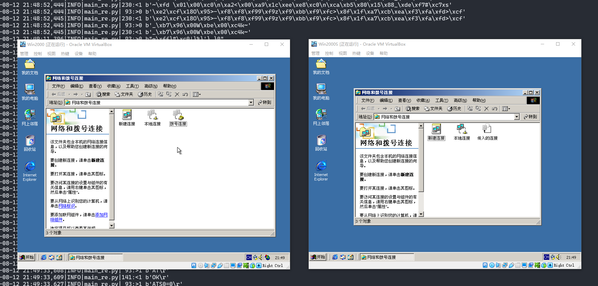

# VirtualModem

VirtualModem is a modem emulator with sound support.
It supports virtual COM port through TCP connection, which is supported by most emulators, such as VirtualBox, VMware and QEMU.

## Dependencies
```
Python >= 3.7
# extra dependency for dialing sound:
pip install simpleaudio
```


## Configuration
You can edit the configuration in `config.py`, here is an example:
```Python
import logging

log_level = logging.ERROR # LogLevel

# you can dial-up to any modem in the host system
modems = [
    {  # modem 1
        'address': ('localhost', 9999),
        'phone': '4805698', # tel number of connected phone line
        'bps': 33600, # support bps: 300/1200/2400/4800/9600/14400/28800/33600/56000
    },
    {  # modem 2
        'address': ('localhost', 8888),
        'phone': '7891234',
        'bps': 33600,
    },
]
```

## Preview

